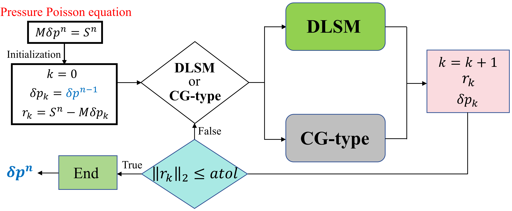

# HyDEA: Hybrid Deep lEarning line-search directions and iterative methods for Accelerated solutions

The source code and dataset for the paper: [Bai H, Bian X. Hybrid deep learning and iterative methods for accelerated solutions of viscous incompressible flow](https://arxiv.org/abs/2506.03016)

<p align="center">
  
</p>

## Code

The code depends on PetIBM(https://github.com/barbagroup/PetIBM/tree/master?tab=readme-ov-file), python, pytorch, petsc4py.

PetIBM should be installed by following the procedure outlined in [B.1](https://github.com/barbagroup/PetIBM/blob/master/doc/markdowns/installation.md) of official installation guide. Before compilation, ensure that you have configured the paths in both the CMakeLists.txt and the source files to match your system environment and examples directory. 

CMakeLists.txt : "/home/xxx/petibm/PetIBM/applications/CMakeLists.txt"

soure files, for example: "/home/xxx/petibm/PetIBM/applications/decoupledibpmHyDEA.cpp"


## Making dataset
Enter the "Making_data" folder and run:
```
python create_training_data.py
```

## Training model
Enter the "Training_code" folder and run:
```
python main.py
```
The trained weights for the 192x192 resolution model can be found at the following folder: “Logger/.../.../states/”

## Running HyDEA
Once PetIBM is installed, the libraries (shared and/or static) are located in the lib folder of your installation directory. The present software package comes with 4 application codes that use the PetIBM library (petibm-navierstokesICPCG, petibm-navierstokesHyDEA, petibm-decoupledibpmICPCG, petibm-decoupledibpmHyDEA). Upon successful installation, the binary executables for these applications are located in the bin folder of your installation directory. If PetIBM is not installed using conda (or mamba), you can prepend the PATH environment variable with the bin directory to use the binary executables:

```shell
$ export PATH=<petibm-installation-directory>/bin:$PATH
```

Run the following command to execute the case:

(1) 2D lid-driven cavity flow, using the ICPCG solver for the Pressure Poisson Equation:
```
cd /home/xxx/petibm/PetIBM/examples/navierstokesICPCG/192cavity
petibm-navierstokesICPCG
```
(2) 2D lid-driven cavity flow, using the HyDEA solver for the Pressure Poisson Equation:
```
cd /home/xxx/petibm/PetIBM/examples/navierstokesHyDEA/192cavity
petibm-navierstokesHyDEA
```
(3) One stationary circular cylinder immersed in 2D lid-driven cavity flow, using the ICPCG solver for the Pressure Poisson Equation:
```
cd /home/xxx/petibm/PetIBM/examples/decoupledibpmICPCG/192_1Cylinder
petibm-decoupledibpmICPCG
```
(4) One stationary circular cylinder immersed in 2D lid-driven cavity flow, using the HyDEA solver for the Pressure Poisson Equation:
```
cd /home/xxx/petibm/PetIBM/examples/decoupledibpmHyDEA/192_1Cylinder
petibm-decoupledibpmHyDEA
```

## Requirements
> - Platforms: Ubuntu 20.04
> - Mamba
> - PetIBM
> - Python 3.8, PyTorch = 2.1.0
> - Pybind 11
> - petsc4py 3.16.6
> - nlohmann


## Citation
If HyDEA contributes to a project that leads to a scientific publication, please cite the project.
You can use this citation below.

```console
@article{Bai_HyDEA,
  title={Hybrid deep learning and iterative methods for accelerated solutions of viscousincompressible flow},
  author={Heming Bai, and Xin Bian},
  journal={arXiv preprint arXiv:2506.03016},
  year={2025}
}
```

## Questions

To get help on how to use the code, simply open an issue in the GitHub "Issues" section.


